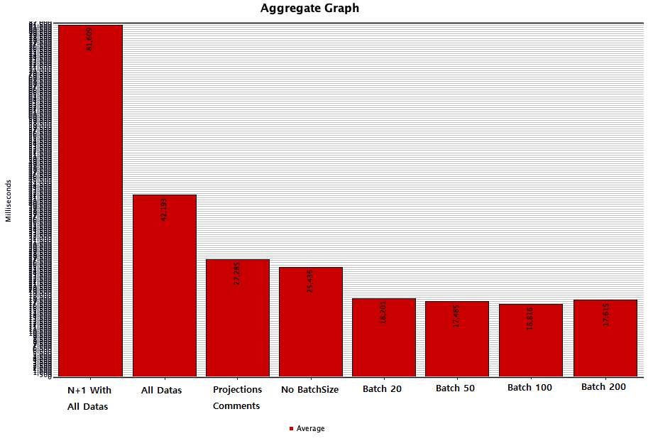
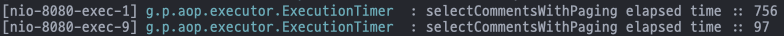
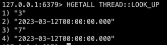
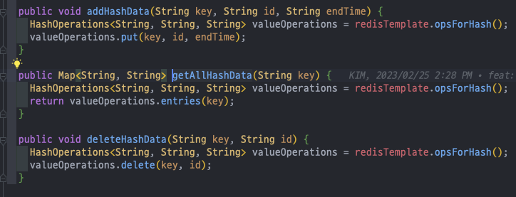
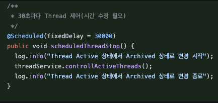
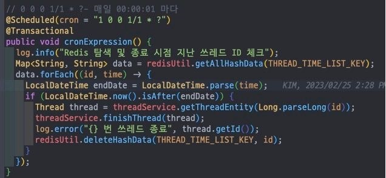
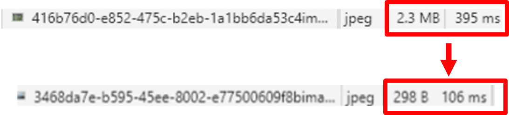

## 01. 프로젝트 소개 💡

### 서비스 명: 🏛️ 우리 모두 철학자 🏛️

**“일상에서 시작된 궁금한 혹은 작은 이슈를 기반으로 생성되는 토론의 장 기반의 커뮤니티 서비스”**  
**“일상에서 피식하며 넘어갈법한 혹은 진지하게 다룰만한 주제를 기반으로 토론을 진행할 수 있도록 도와주는 서비스”**

- 일상속에서 부딪히는 **수 많은 논쟁**
- 이러한 수 많은 논쟁에 관한 이야기를 할 **공간의 부재**
- 다양한 사람들과 직접적으로 정보를 공유하고, 언어적 의사소통을 통해 “**새로운 자극**”을 받음
- 커뮤니티라는 기능 속에서 **변화하는 장소와 패턴**

“**이러한 문제점을 완화하고 새로운 방식의 커뮤니티의 제작”**

["우리 모두 철학자" 사이트 접속하기](http://the-gladiators.s3-website.ap-northeast-2.amazonaws.com/main)  
["우리 모두 철학자" 백엔드 코드 확인하기](https://github.com/bigquann97/philosopher-back)  
["우리 모두 철학자" 원페이지 노션 확인하기](https://radical-route-999.notion.site/8cc586e7170343c8806c312f3da97131)  
["우리 모두 철학자" 회의록 노션 확인하기](https://puzzled-bee-d4c.notion.site/847736be8f8a4775866b67b6dc484d4b?v=3736681424c34f6983dc166ff533347f)  
["우리 모두 철학자" 그라운드룰 확인하기](https://coherent-eclipse-711.notion.site/Ground-Rule-57dbbe48c09242edb2c263bf6a55e257)  
["우리 모두 철학자" Wiki(구현 명세서) 확인하기](https://github.com/bigquann97/philosopher-back/wiki)  

 프로젝트에 대한 더 자세한 소개가 보고싶다면? 😀

 

  
**“궁금한건 못참아 !”, “ 다른 사람의 생각도 궁금해 “**

우리 삶 주변에는 우리들의 호기심을 자극하는 요소들이 많습니다.  
언제나 우리는 이러한 요소들로 하여금 재미있는 상상의 나래를 펼치고 이 상상의 날개는 호기심과 궁금증을 유발하며,  
흥미있는 토픽들을 이용해 타인과 소통하기도 합니다.  
이러한 다양한 이슈들을 누구나 한 번쯤은 고민해보고 접해봤을 것입니다. 
이 속에는 다양한 논쟁거리가 존재합니다.  
여러 사람들과의 언어적 상호작용 속에서 새로운 인사이트를 얻기도 하며,  
타인의 생각을 읽고 논리적으로 반박하기도 합니다.  
이렇게 우리는 커뮤니티를 이용해 상호간 언어적 의사소통을 이용해 새로운 관계를 형성하고,  
새로운 또 하나의 커뮤니티와 문화를 형성하며 오늘도 성장합니다. 

## **‘그(사용자)’들의 라이프 스타일 & 타겟팅 사용 유저**

- 서비스에서 주 타겟으로 삼고 있는 ‘**잠재적 고객**’들은 SNS 혹은 커뮤니티를 통해 **자신의 생각을 타인과 공유**
- **자신을 표현하는 방식**으로 **SNS 서비스와 커뮤니티 서비스를 활용하는 사람**
- 이미 젊은 사람들은 여러 커뮤니티를 사용 中
- 커뮤니티는 변화와 유행에 민감하며, 이 커뮤니티를 이용하는 사람들은 자신이 원하는 정보를 쉽게 찾아내고 SNS 혹은 커뮤니티를 통해 잘 활용함
- “이”(사용자)들은 글로서 자신을 표현하고 자신의 의견을 공유하는데 능숙함

### **어떻게 콘텐츠를 표현할 것인가? 이 아이템을 어떤 방식을 사용해야 잘 표현할 수 있을까??**

- 토론 = 언어적 상호작용을 기반으로 동작
- 언어적 상호작용을 가장 **잘 풀어낼 수 있는 서비스 = 커뮤니티 서비스**

## **요즘의 동향는 어떠할까? 유행? 어필?**

- **자신을 표현하는 하나의 수단으로 자리잡은 커뮤니티 서비스와 SNS 서비스**
- 다양한 색을 가진 커뮤니티 속, 온라인/오프라인의 경계가 희미해짐
- **SNS와 커뮤니티를 이용한 좁고 깊은 관계에서 넓고 얕은 스펙트럼의 관계 형성**

## **그럼 우리 서비스의 핵심 가치는 무엇인가?**

- **재미**
- **정보공유**
- **높은 자유도**
- **상호작용**
- **시간보내기**

---

## 02. 팀원 소개 👨‍👩‍👦‍

|리더|부리더|팀원|팀원|                                      팀원                                      |
|:---:|:---:|:---:|:---:|:----------------------------------------------------------------------------:|
||||||
|김지환|김관호|김미란|박도화|                                     이승윤                                      |
|[Github](https://github.com/jipang9) [Blog](https://jipang9-greedy-pot.tistory.com/)|[Github](https://github.com/bigquann97) [Blog](https://velog.io/@bigquann97)|[Github](https://github.com/h7359841) [Blog](https://velog.io/@h7359841)|[Github](https://github.com/dohwapark) [Blog](https://dzzzdee.tistory.com/)| [Github](https://github.com/lssy32) [Blog](https://yuniday2.tistory.com/) |

## 03. 기술 스택 🛠️

#### Front-End 🔨

#### Back-End 🔧

 

  
  
  

#### Server 🪚

#### Etc ⛓️

---

## 04. 프로젝트의 핵심 가치 💎

- <b>"우리 모두 철학자"</b> 만의 고유한 흐름과 독창성을 구축하고자 했습니다.
- 이유 있는 코드의 작성과 기술 선택을 하고자했습니다.
- 더미 데이터를 통한 대용량 처리 및 성능 개선을 목표로 했습니다.
- 팀원들간의 협업 및 원활한 의사소통을 중요하게 생각했습니다.
- Redis / Docker 등의 기술 사용 및 실력 기르기를 목표로 삼았습니다.
- 문서화, 시각화, 정리 등을 통한 의사소통 장애를 극복하고자 했습니다.

## 05. 프로젝트 PPT, 발표 링크, MVP 시연 영상 📺

- [발표 자료 PPT](https://docs.google.com/presentation/d/1HwKDdvIMr0uJqJ9uKLcJXGcT-bQR_K-R/edit?usp=sharing&ouid=107322356350634651146&rtpof=true&sd=true)
- [발표 영상 Youtube](https://www.youtube.com)
- [MVP 시연 영상 Youtube](https://www.youtube.com)

## 06. 서비스 아키텍쳐 📊

## 07. 기술적 의사결정 ✅

 1. Querydsl 👓 

 

 

- **기술적 필요성:**

1. 검색, 정렬, 필터링 및 통계 확인 등의 동적 쿼리 작성
2. 지속적 리팩토링을 통한 쿼리 성능 향상 및 최적화

 

- **해결 방안 리스트업:**

1. JPQL - if문을 통한 분기 + 문자열 하나라도 잘못될 경우 오류 발생(컴파일 시점에서 파악 불가)
2. Mybatis, JDBC Template (Query Mapper) - 복잡한 사용성, DB 의존성
3. Querydsl - Qtype 의존성 발생, 빈약한 Bean 생성

 

- **해결 방안에 대한 의사 조율 및 결정:**

1. 내부적으로 BooleanExpression, OrderSpecifier 등을 통한 동적 쿼리 작성
2. Java 기반 JPQL의 작성 - 사용성과 가독성 ⇒ 팀적 협업에 도움
3. Projection 등을 통해 조회를 원하는 컬럼 수를 편하게 줄이기 가능
4. 컴파일 시점에서 오류를 잡아줌 + 편리한 최적화
5. 현재 프로젝트 규모에서는 한계점의 극복이 가능하다고 판단  

**⇒ Querydsl 채택**

 

 2. Github Actions 💫 

 

 

- **기술적 필요성:**

1. 협업을 진행하면서 팀원간 반복적인 빌드, 테스트 등의 자동화 및 통합적 환경 구축
2. 추후 CD 구축을 위한 기반 기술 필요성

 

- **해결 방안 리스트업:**

1. Jenkins
2. Github Actions
3. Bamboo

 

- **해결 방안에 대한 의사 조율 및 결정:**

1. Bamboo - 금전적 비용의 발생 및 레퍼런스 부족
2. 프로젝트의 규모를 고려한 의사 결정 - Jenkins 사용을 통한 리소스 낭비 발생 가능성
3. 환경 구성, 호환성 구축 등의 추가적 작업이나 복잡한 절차 없이 현재 협업 환경에 바로 적용 가능  

**⇒ Github Actions 채택**

 

 3. Redis 🎈 

 

 

- **기술적 필요성:**

1. JWT 인증/인가 방식 채택으로 인한 Refresh Token 보관 필요성
2. 서버 리소스 접근을 허용하는 중요한 수단인 만큼 보안성/사용성 고려 필요

 

- **해결 방안 리스트업:**

1. RDB에 컬럼 추가
2. Redis 적용

 

- **해결 방안에 대한 의사 조율 및 결정:**

1. 토큰의 탈취 가능성 고려 및 Black-list 구현을 위한 기술의 필요성
2. TTL 기능의 활용을 통한 토큰에 대한 수명 관리
3. 유효 기간 코드 기반 이메일 인증 서비스 구축 예정, Redis 채택 가능성이 높음  

**⇒ Redis를 통한 토큰 및 관련 정보 관리 채택**

 

 4. SSE Emitter 🔋 

 

 

- **기술적 필요성:**

1. 댓글, 쓰레드화 알림 시 통신 방식에 대한 고민
2. 비연결성(Connectionless)의 특성을 가진 HTTP 특성상, 알림을 줄 수 있는 통신 방식 고려 필요

 

- **해결 방안 리스트업:**

1. Polling
2. Long Polling
3. Web Socket
4. Server-Sent-Event

 

- **해결 방안에 대한 의사 조율 및 결정:**

1. 실시간성이 떨어지며, 상태 변경에 대한 연결 요청이 추가 발생하는 **Polling, Long Polling**

3. 서버에서 클라이언트로 단방향 통신, HTTP 프로토콜만으로 사용 가능해 가벼운 **SSE**

3. 서버 <=> 클라이언트 간 양바향 통신, 최초 연결시에만 Header 정보 전달,  
   \+ 연결에 불필요한 비용 제거 가능한 **Web Socket**  

**<tab> ⇒ Server-Sent-Event 채택**

 

 5. Image Resize - Marvin Library 

 

 

- **기술적 필요성:**

1. 페이징 렌더링 속도의 개선 필요
2. 한정된 DB 용량으로 인한 이미지 사이즈 압축 필요 (AWS 프리티어)
3. 이미지 크기의 일관성 필요

 

- **해결 방안 리스트업:**

1. java-image-scaling
2. Marvin
3. AWS CloudFront & Lambda@Edge

 

- **해결 방안에 대한 의사 조율 및 결정:**

1. 자바 내부 라이브러리에 구현된 이미지 리사이징 기술 java-image-scaling 
   (Width 기준 원본 비율로 높이가 정해짐)

2. 다른 라이브러리 대비 적은 시간이 소요되며 간편한 사용성을 가진 Marvin

3. 이미지 업로드/다운로드 전략 선택이 가능한 AWS 리사이징

4. 적은 시간 소요 + 원본 보존율 + 추가 코드 작성 및 관리 포인트 발생이 적은 Marvin  

**⇒ Marvin Library 채택**

 

## 08. 트러블 슈팅

 1. 멘션 조회 성능 📈 

 

- **문제의 발견:**

    1. 더미데이터 추가를 통한 어플리케이션 전체 흐름 점검

        - 쓰레드 더미데이터 생성
        - 댓글 더미데이터 생성
        - 한 페이지 내 20,000 개의 멘션 생성

    2. AOP 적용을 통한 병목 발생 지점 파악 및 점검

        - 메서드별 수행 속도 측정
        - 멘션 더미데이터 생성한 지점에서 800 ms 이상의 성능 저하 발생 확인

    3. API 호출시, 쿼리 발생 확인
        - hibernate >> show sql 을 통한 발생 쿼리 확인

 

- **문제 해결 과정:**

    1. Jmeter 적용 - 부하 테스트 진행

    1. 쿼리 분석

        - N + 1 쿼리 발생 구간 확인 및 Lazy Loading, Join 수정
        - 최초 N + 1 문제 발생 해결

    2. Querydsl 적용

        - 가독성 높은 코드의 작성
        - join 등 쿼리 작성

    3. Projections 적용

        - 필요한 요소만 select
        - select 문 최소화

    4. Batch Size 적용

        - MentionedList, MentioningList 등 OneToMany 요소 호출시 문제 발생
        - Batch Size 적용을 통한 in query 개수 정의

    5. Batch Size 최적 단위 파악

        - 20, 50, 100, 200 순서로 속도 측정

 

- **트러블 슈팅 결과:**

    1. 20,000 개의 멘션 상황 - 1000 Threads, in 1 second, 3 requests 부하 상황 가정
        - 81,609 ms => 17,615 ms 로 79.4% 의 성능 개선

    2. AOP - 단일 요청에 대한 메서드 속도 측정 (Elapsed Time)
        - 756 ms => 97 ms 로 87.1% 의 성능 개선

  

- jmeter  
    

 

- aop  
    

 2. 쓰레드 종료 시점 - 스케줄링 및 쿼리 최적화 💻 

 

- **문제의 발견:**

    1. 흐름 문제

        - 쓰레드화 된 후, 24시간 이후를 쓰레드 종료시점으로 책정
        - 1초마다 쿼리를 날려도 데이터 정보가 어긋나는 현상 발생
        - 매 30초 마다 쿼리를 날리는 것으로 결정했지만, 데이터 정확도 위반

    2. 논리 문제

        - 쓰레드 종료 쿼리(상태 변경 쿼리) 날릴 시, Thread 테이블 내 모든 대상을 조회
        - 모든 대상 조회 후, 모든 대상 별 쓰레드 종료 시점 지났는지 확인하는 로직 발생

    3. 코드 문제
        - 스케쥴러 코드: 30초마다 쿼리 발생
        - Redis: 미적용

 

- **문제 해결 과정:**

    1. 흐름 최적화

        - 쓰레드화 된 이후, 하루 뒤 자정을 쓰레드 종료시점을 책정
        - 자정에만 쿼리가 발생하도록 어플리케이션 흐름 조정

    1. 논리 최적화

        - 테이블 내 모든 컬럼 대상이 아닌, 해당 시점이 지난 쓰레드 ID 값에 대해서만 쿼리 발생 목표
        - 새로운 데이터를 담을 공간 필요
        - Redis 를 통한 문제 해결 (다양한 데이터 형태 담기)

    1. 코드 최적화

        - 위의 내용을 적용한 코드 작성
        - Scheduler: 30초마다 쿼리 => 매 자정마다 쿼리
        - Redis: 쓰레드화 될 때 마다, ID/종료시간(key/value) 을 redis에 저장

 

- **트러블 슈팅 결과:**

    1. 매 30초마다 쿼리 발생 (30초 마다 쿼리 함에도 데이터 정확도 위반)
        - => 자정에만 쿼리 발생

    2. Thread 테이블 내 모든 데이터 대상 상태 조회 및 변경 쿼리 발생
        - => 마감 시간이 지난 쓰레드 ID에 대해서만 상태 변경 쿼리 발생

    3. Scheduler 및 Redis 코드 문제
        - => 해당 로직에 Redis 적용 및 Scheduler 코드 최적화

 

- Redis Code  

 

- Scheduler Before  

 

- Scheduler After  

 

 3. 이미지 용량과 성능 🖼️ 

 

- **문제의 발견:**

    1. 사진이 있는 페이지 로딩시 눈에 띄는 지연 현상 발생
    2. 이미지 파일의 크기가 불규칙적
    3. 한정된 리소스 자원 - AWS 프리티어
    4. 페이지 렌더링 속도리 개선 필요성

 

- **문제 해결 과정:**

    1. S3 버킷 내 이미지 업로드 용량 확인

        - 평균 2 ~ 3 MB 용량의 사진 업로드 발생

    1. 크롬 개발자 도구를 통한 이미지 로딩 속도 측정

        - 350 ms ~ 450 ms의 평균 이미지 업로드 속도 발생

    1. Marvin 라이브러리 적용

        - 기술적 의사 결정을 통한 Marvin 라이브러리 채택
        - 어플리케이션 코드 내 이미지 리사이징 코드 작성

 

- **트러블 슈팅 결과:**

    1. S3 버킷 내 저장된 이미지 용량 감소
        - => 2.2 MB, JPEG 사진 => 55.2 KB로 크기 압축 및 개선

    2. 페이지 렌더링 시, 이미지 로딩 속도 개선
        - => 395 ms => 106 ms 로 전송 속도 73.1% 개선

 

- Redis Code  

 

## 09. ERD 설계도

[ERD 원본 확인하기 - ERD Cloud](https://www.erdcloud.com/d/nruo9xdTwK4DNbKnD)

## 10. API 설계도

[API 스펙 원본 확인하기 - Google Spreadsheet](https://docs.google.com/spreadsheets/d/14_rE71JfKZD7DUaTCJmSuh-ol-pqmgdyEybgZavywR0/edit?usp=sharing)
